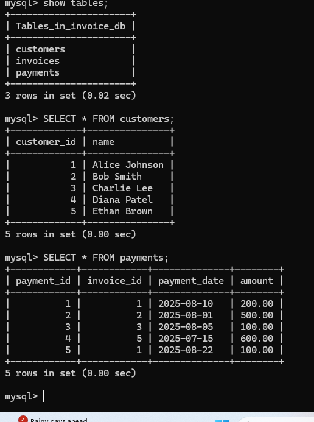
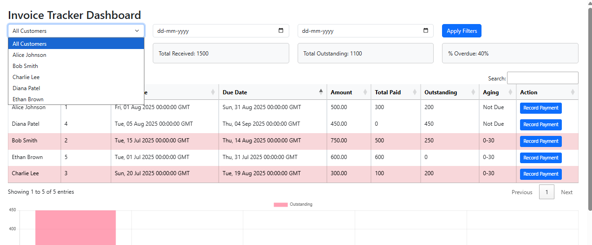
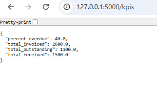
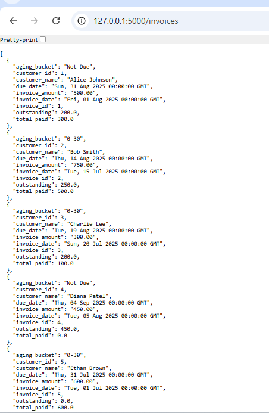
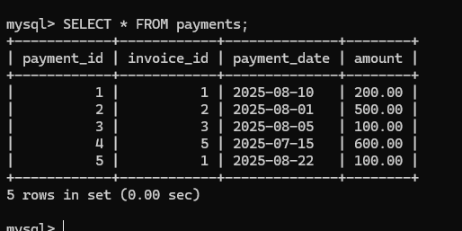
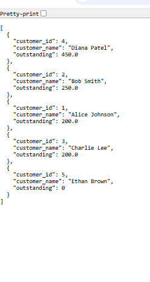
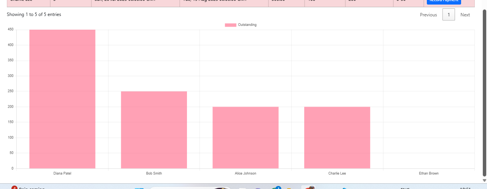
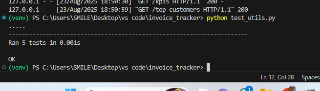

# Invoice Tracker

A full-stack Invoice Tracking application built with **Flask + MySQL**.  
It allows managing customers, invoices, and payments with real-time KPIs, invoice aging analysis, and payment recording.

---

##  Features
-  **Database**: MySQL with 3 tables (Customers, Invoices, Payments)
- **Invoices API**: View invoices with customer details, payments, outstanding amount & aging buckets
-  **Payments API**: Add payments (partial or full) for invoices
- **Dashboard**:
  - Filters: Customer dropdown, Invoice Date range
  - KPI Tiles: Total Invoiced, Total Received, Total Outstanding, % Overdue
  - Invoice Table: Search, sort, overdue highlighting
  - Record Payment action
  - Chart: Top 5 customers by outstanding / Monthly Invoiced vs Received
-  **Testing**: Utility function `compute_aging_bucket()` with unit tests

---

##  Tech Stack
- **Backend**: Python (Flask), MySQL
- **Frontend**: Jinja2, Bootstrap, Chart.js, DataTables
- **Testing**: Python unittest
- **Version Control**: Git & GitHub (feature branch → PR → merge workflow)

---

##  Database Schema
```sql
CREATE TABLE customers (
  customer_id SERIAL PRIMARY KEY,
  name TEXT NOT NULL
);

CREATE TABLE invoices (
  invoice_id SERIAL PRIMARY KEY,
  customer_id INT NOT NULL REFERENCES customers(customer_id),
  invoice_date DATE NOT NULL,
  due_date DATE NOT NULL,
  amount NUMERIC(12,2) NOT NULL CHECK (amount >= 0)
);

CREATE TABLE payments (
  payment_id SERIAL PRIMARY KEY,
  invoice_id INT NOT NULL REFERENCES invoices(invoice_id),
  payment_date DATE NOT NULL,
  amount NUMERIC(12,2) NOT NULL CHECK (amount > 0)
);
````

---

##  How to Run

1. Clone this repo:

   ```bash
   git clone https://github.com/gunashree-bh/invoice-tracker.git
   cd invoice-tracker
   ```

2. Create virtual environment & install dependencies:

   ```bash
   python -m venv venv
   venv\Scripts\activate   # On Windows
   pip install -r requirements.txt
   ```

3. Create MySQL DB & run schema:

   ```bash
   mysql -u root -p
   CREATE DATABASE invoice_db;
   USE invoice_db;
   SOURCE schema.sql;
   ```

4. Run Flask app:

   ```bash
   python app.py
   ```

5. Open in browser:

   ```
   http://127.0.0.1:5000/
   ```

---

## Screenshots

###  Database Setup



###  Customer Dropdown Filter



###  KPI Tiles



###  Invoice Table



###  Record Payment Modal



###  Top 5 Customers Table



### Top Customers Graph



###  Unit Tests for Utility Function



### Full Dashboard


---

##  Testing

Run unit tests for utility functions:

```bash
python test_utils.py
```

---

## Assignment Workflow

* Created `feature/invoice-tracker` branch
* Opened a Pull Request into `main`
* Merged PR to follow GitHub best practices

---

## Author

**Gunashree B H**


